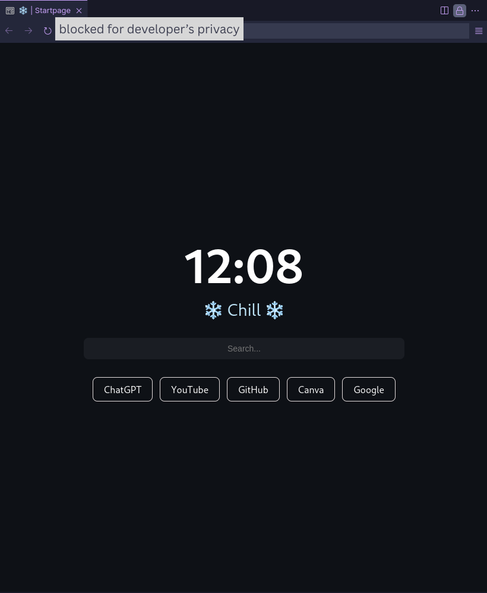

# 🌐 Custom Startpage

A minimalist, blazing-fast startpage for your browser.  
Designed for devs, designers, and tinkerers who love clean design and instant access.

> Built with ❤️ by [@sparshabhusal](https://github.com/sparshabhusal)

---

## 🖼️ Preview



---

## ✨ Features

- ⚡ Super lightweight (just HTML + CSS)
- 🌙 Dark mode ready
- 🔍 Search bar with optional shortcuts
- 🔗 Quick access links to favorite sites
- ⏰ Live clock and date ( 12 hour clock format )
- 💅 Fully customizable layout and style
- 🌐 Works offline – great for local setup

---

## 🚀 Usage

1. **Clone this repository:**
   ```bash
   git clone https://github.com/sparshabhusal/homepage.git

2 . Open index.html in your browser.

   -(Optional) Set it as your homepage in browser settings:

   Firefox: Preferences → Home → Homepage and new windows

   Chrome: Settings → On startup → Open a specific page

## 🎯 Why?
I built this to match my minimalist workflow on Linux + Tiling WMs.  
No distractions. Just fast access to what I use daily.

